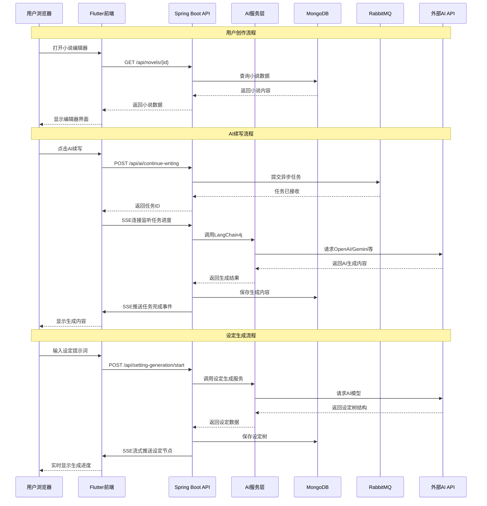
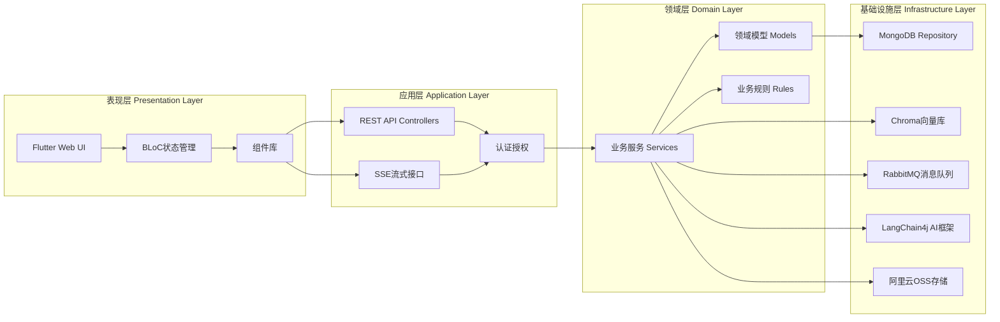

# 马良AI写作 - 系统架构文档

本文档详细描述了马良AI写作平台的系统架构，包括整体架构、数据流程和技术栈分层设计。

---

## 一、整体架构图

### 架构概述

马良AI写作采用**前后端分离**的微服务架构，前端使用Flutter Web构建单页应用，后端采用Spring Boot WebFlux响应式框架。整体架构分为用户层、前端应用层、后端服务层、数据存储层、外部服务层和监控层六个主要层次。

### 架构图

```mermaid
graph TB
    subgraph "用户层"
        WebBrowser[Web浏览器]
        AdminBrowser[管理员浏览器]
    end

    subgraph "前端应用层 - Flutter Web"
        direction TB
        MainApp[主应用<br/>main.dart]
        AdminApp[管理后台<br/>admin_main.dart]
        
        subgraph "状态管理 - BLoC"
            AuthBloc[AuthBloc<br/>认证状态]
            NovelBloc[NovelListBloc<br/>小说列表]
            EditorBloc[EditorVersionBloc<br/>编辑器版本]
            ChatBloc[ChatBloc<br/>AI聊天]
            AIConfigBloc[AiConfigBloc<br/>AI配置]
            CreditBloc[CreditBloc<br/>积分管理]
            SettingBloc[SettingGenerationBloc<br/>设定生成]
            KnowledgeBloc[KnowledgeBaseBloc<br/>知识库]
        end
        
        subgraph "UI组件层"
            NovelEditor[富文本编辑器<br/>Flutter Quill]
            NovelList[小说列表界面]
            SettingTree[设定树可视化]
            ChartWidget[图表组件<br/>fl_chart]
            AIToolbar[AI工具栏]
        end
        
        subgraph "服务层"
            ApiClient[ApiClient<br/>HTTP客户端]
            SseClient[SseClient<br/>SSE流式连接]
            AuthService[AuthService<br/>认证服务]
            LocalStorage[LocalStorageService<br/>本地存储]
        end
    end

    subgraph "后端服务层 - Spring Boot WebFlux"
        direction TB
        
        subgraph "Web层 - Controllers"
            NovelController[NovelController<br/>小说管理]
            ChatController[ChatController<br/>AI聊天]
            SettingController[SettingGenerationController<br/>设定生成]
            AdminController[AdminController<br/>管理后台]
            AuthController[AuthController<br/>认证授权]
            LLMObservabilityController[LLMObservabilityController<br/>可观测性]
        end
        
        subgraph "业务服务层 - Services"
            NovelService[NovelService<br/>小说业务]
            AIService[AIService<br/>AI调用服务]
            SettingService[SettingGenerationService<br/>设定生成服务]
            KnowledgeService[KnowledgeExtractionService<br/>知识提取服务]
            UserService[UserService<br/>用户管理]
            CreditService[CreditService<br/>积分计费]
        end
        
        subgraph "AI集成层"
            LangChain4j[LangChain4j<br/>AI框架]
            OpenAIProvider[OpenAI Provider]
            AnthropicProvider[Anthropic Provider]
            GeminiProvider[Gemini Provider]
            ZhipuProvider[智谱AI Provider]
            QwenProvider[通义千问 Provider]
        end
        
        subgraph "数据访问层 - Repositories"
            NovelRepository[NovelRepository<br/>MongoDB Reactive]
            UserRepository[UserRepository]
            SettingRepository[SettingRepository]
            LLMLogRepository[LLMLogRepository<br/>调用日志]
        end
        
        subgraph "任务处理层"
            TaskQueue[RabbitMQ<br/>任务队列]
            AsyncTaskService[AsyncTaskService<br/>异步任务服务]
            KnowledgeExtractionTask[知识提取任务]
            ContinueWritingTask[自动续写任务]
        end
        
        subgraph "安全与认证"
            SecurityConfig[Spring Security<br/>安全配置]
            JWTService[JWT服务<br/>Token生成验证]
        end
    end

    subgraph "数据存储层"
        MongoDB[(MongoDB 8.0<br/>主数据库<br/>副本集)]
        Chroma[(Chroma<br/>向量数据库<br/>RAG支持)]
        LocalStorageFS[本地文件存储<br/>/app/web/]
        AliyunOSS[阿里云OSS<br/>对象存储]
    end

    subgraph "外部服务"
        OpenAIAPI[OpenAI API]
        AnthropicAPI[Anthropic API]
        GeminiAPI[Google Gemini API]
        ZhipuAPI[智谱AI API]
        QwenAPI[通义千问 API]
        FanqieAPI[番茄小说拆书服务]
        AliyunSMS[阿里云SMS<br/>短信服务]
        AlipayAPI[支付宝API<br/>支付服务]
    end

    subgraph "监控与可观测性"
        Prometheus[Micrometer<br/>Prometheus指标]
        SkyWalking[SkyWalking<br/>分布式追踪]
        LogSystem[日志系统<br/>Logback]
    end

    %% 用户层到前端
    WebBrowser --> MainApp
    AdminBrowser --> AdminApp

    %% 前端内部连接
    MainApp --> AuthBloc
    MainApp --> NovelBloc
    MainApp --> EditorBloc
    MainApp --> ChatBloc
    MainApp --> AIConfigBloc
    MainApp --> CreditBloc
    MainApp --> SettingBloc
    MainApp --> KnowledgeBloc
    
    AuthBloc --> AuthService
    NovelBloc --> ApiClient
    ChatBloc --> ApiClient
    ChatBloc --> SseClient
    SettingBloc --> ApiClient
    SettingBloc --> SseClient
    
    NovelEditor --> EditorBloc
    NovelList --> NovelBloc
    SettingTree --> SettingBloc
    ChartWidget --> CreditBloc
    AIToolbar --> ChatBloc
    
    ApiClient --> AuthService
    SseClient --> AuthService

    %% 前端到后端
    ApiClient -->|HTTP/REST| NovelController
    ApiClient -->|HTTP/REST| ChatController
    ApiClient -->|HTTP/REST| SettingController
    ApiClient -->|HTTP/REST| AuthController
    ApiClient -->|HTTP/REST| AdminController
    SseClient -->|SSE流式| ChatController
    SseClient -->|SSE流式| SettingController

    %% 后端内部连接
    NovelController --> NovelService
    ChatController --> AIService
    SettingController --> SettingService
    AdminController --> UserService
    AdminController --> LLMObservabilityController
    AuthController --> JWTService
    
    NovelService --> NovelRepository
    AIService --> LangChain4j
    SettingService --> LangChain4j
    KnowledgeService --> LangChain4j
    UserService --> UserRepository
    CreditService --> UserRepository
    
    NovelRepository --> MongoDB
    UserRepository --> MongoDB
    SettingRepository --> MongoDB
    LLMLogRepository --> MongoDB
    
    LangChain4j --> OpenAIProvider
    LangChain4j --> AnthropicProvider
    LangChain4j --> GeminiProvider
    LangChain4j --> ZhipuProvider
    LangChain4j --> QwenProvider
    
    OpenAIProvider --> OpenAIAPI
    AnthropicProvider --> AnthropicAPI
    GeminiProvider --> GeminiAPI
    ZhipuProvider --> ZhipuAPI
    QwenProvider --> QwenAPI
    
    AIService --> Chroma
    KnowledgeService --> Chroma
    KnowledgeService --> FanqieAPI
    
    %% 任务处理
    NovelService --> TaskQueue
    TaskQueue --> AsyncTaskService
    AsyncTaskService --> KnowledgeExtractionTask
    AsyncTaskService --> ContinueWritingTask
    KnowledgeExtractionTask --> KnowledgeService
    
    %% 安全
    SecurityConfig --> JWTService
    AuthController --> SecurityConfig
    
    %% 存储
    NovelService --> LocalStorageFS
    NovelService --> AliyunOSS
    UserService --> AliyunSMS
    CreditService --> AlipayAPI
    
    %% 监控
    NovelService --> Prometheus
    AIService --> SkyWalking
    NovelService --> LogSystem
    AIService --> LogSystem

    %% 样式
    classDef frontend fill:#42A5F5,stroke:#1976D2,color:#fff
    classDef backend fill:#66BB6A,stroke:#388E3C,color:#fff
    classDef database fill:#FFA726,stroke:#F57C00,color:#fff
    classDef external fill:#AB47BC,stroke:#7B1FA2,color:#fff
    classDef monitor fill:#26A69A,stroke:#00695C,color:#fff
    
    class MainApp,AdminApp,AuthBloc,NovelBloc,EditorBloc,ChatBloc,AIConfigBloc,CreditBloc,SettingBloc,KnowledgeBloc,NovelEditor,NovelList,SettingTree,ChartWidget,AIToolbar,ApiClient,SseClient,AuthService,LocalStorage frontend
    class NovelController,ChatController,SettingController,AdminController,AuthController,LLMObservabilityController,NovelService,AIService,SettingService,KnowledgeService,UserService,CreditService,LangChain4j,OpenAIProvider,AnthropicProvider,GeminiProvider,ZhipuProvider,QwenProvider,NovelRepository,UserRepository,SettingRepository,LLMLogRepository,TaskQueue,AsyncTaskService,KnowledgeExtractionTask,ContinueWritingTask,SecurityConfig,JWTService backend
    class MongoDB,Chroma,LocalStorageFS,AliyunOSS database
    class OpenAIAPI,AnthropicAPI,GeminiAPI,ZhipuAPI,QwenAPI,FanqieAPI,AliyunSMS,AlipayAPI external
    class Prometheus,SkyWalking,LogSystem monitor
```



### 架构详细讲解

#### 1. 用户层（User Layer）

**组件说明：**
- **Web浏览器**：普通用户通过Web浏览器访问主应用，进行小说创作、AI辅助等功能
- **管理员浏览器**：管理员通过独立的管理后台入口访问，进行用户管理、模型配置、可观测性监控等

**设计要点：**
- 主应用和管理后台使用不同的入口（`main.dart` 和 `admin_main.dart`），实现功能隔离
- 支持多标签页协调，避免重复的SSE连接

#### 2. 前端应用层（Frontend Application Layer）

前端采用Flutter Web技术栈，使用BLoC模式进行状态管理，实现了清晰的关注点分离。

##### 2.1 状态管理层（BLoC Pattern）

**核心BLoC组件：**

- **AuthBloc**：管理用户认证状态（登录/登出/Token刷新）
  - 监听认证状态变化，自动加载用户配置
  - 处理401错误，自动登出并清理状态
  
- **NovelListBloc**：管理小说列表数据
  - 加载用户的所有小说作品
  - 支持搜索、筛选、排序功能
  
- **EditorVersionBloc**：管理编辑器版本控制
  - 跟踪章节内容的版本历史
  - 支持版本对比和回滚
  
- **ChatBloc**：管理AI聊天功能
  - 处理与AI的对话交互
  - 支持流式响应（SSE）实时显示AI回复
  
- **AiConfigBloc**：管理用户AI模型配置
  - 加载用户的私有API Key配置
  - 管理模型选择和使用偏好
  
- **CreditBloc**：管理用户积分
  - 实时显示积分余额
  - 监听积分变化事件（如自动续写任务完成）
  
- **SettingGenerationBloc**：管理世界观设定生成
  - 处理设定树的生成请求
  - 通过SSE接收流式生成的设定节点
  
- **KnowledgeBaseBloc**：管理知识库功能
  - 加载拆书任务列表
  - 管理知识库内容的查询和展示

**设计优势：**
- 状态集中管理，便于调试和维护
- 支持状态持久化（Hive本地存储）
- 自动处理状态清理，避免跨用户数据污染

##### 2.2 UI组件层

**核心UI组件：**

- **NovelEditor（富文本编辑器）**：基于Flutter Quill实现
  - 支持上千章节连续滚动
  - 提供丰富的格式选项（加粗、斜体、标题等）
  - 集成AI工具栏，支持续写、润色等快捷操作
  
- **NovelList（小说列表界面）**：展示用户的所有作品
  - 卡片式布局，支持网格和列表视图切换
  - 显示作品统计信息（字数、章节数等）
  
- **SettingTree（设定树可视化）**：展示世界观设定结构
  - 树状结构展示角色、地点、物品等设定
  - 支持节点的展开/折叠、编辑、删除操作
  
- **ChartWidget（图表组件）**：基于fl_chart实现
  - Token消耗趋势图
  - 功能使用分布饼图
  - 模型偏好分析图
  
- **AIToolbar（AI工具栏）**：集成在编辑器中的AI功能入口
  - 续写、扩写、润色、翻译等快捷按钮
  - 一键调用预设的AI功能

##### 2.3 服务层

**核心服务：**

- **ApiClient**：统一的HTTP客户端
  - 封装Dio，提供统一的请求拦截器
  - 自动处理Token刷新和401错误
  - 支持请求重试和错误处理
  
- **SseClient**：Server-Sent Events客户端
  - 管理SSE连接的生命周期
  - 支持连接暂停/恢复（跨标签页协调）
  - 处理连接失败重试（指数退避策略）
  
- **AuthService**：认证服务
  - 管理JWT Token的存储和刷新
  - 处理登录/登出逻辑
  - 提供全局认证状态监听
  
- **LocalStorageService**：本地存储服务
  - 使用Hive存储用户偏好设置
  - 缓存小说列表等常用数据
  - 支持离线数据访问

#### 3. 后端服务层（Backend Service Layer）

后端采用Spring Boot WebFlux响应式框架，实现了高并发、非阻塞的异步处理能力。

##### 3.1 Web层（Controllers）

**REST API控制器：**

- **NovelController**：小说管理接口
  - `GET /api/novels`：获取小说列表
  - `GET /api/novels/{id}`：获取小说详情
  - `POST /api/novels`：创建新小说
  - `PUT /api/novels/{id}`：更新小说信息
  - `POST /api/novels/{id}/chapters`：创建章节
  
- **ChatController**：AI聊天接口
  - `POST /api/chat/message`：发送聊天消息
  - `GET /api/chat/stream`：SSE流式聊天（实时响应）
  
- **SettingGenerationController**：设定生成接口
  - `POST /api/setting-generation/start`：启动设定生成
  - `GET /api/setting-generation/stream/{taskId}`：SSE流式接收生成节点
  
- **AdminController**：管理后台接口
  - 用户管理、角色管理、模型配置等
  - 提供完整的CRUD操作
  
- **AuthController**：认证授权接口
  - `POST /api/auth/login`：用户登录
  - `POST /api/auth/register`：用户注册
  - `POST /api/auth/refresh`：刷新Token
  
- **LLMObservabilityController**：可观测性接口
  - `GET /api/admin/llm-observability/logs`：查询LLM调用日志
  - `GET /api/admin/llm-observability/stats`：获取统计信息

**设计特点：**
- 所有接口都经过Spring Security认证拦截
- 支持CORS跨域请求
- 统一的异常处理和响应格式

##### 3.2 业务服务层（Services）

**核心业务服务：**

- **NovelService**：小说业务逻辑
  - 处理小说的CRUD操作
  - 管理章节的层级关系
  - 处理小说导入（TXT文件解析）
  - 生成章节大纲（AI辅助）
  
- **AIService**：AI调用服务
  - 统一的AI模型调用接口
  - 支持多种AI Provider（OpenAI、Anthropic、Gemini等）
  - 实现模型路由策略（根据标签选择模型）
  - 处理流式响应和错误重试
  
- **SettingGenerationService**：设定生成服务
  - 根据提示词生成结构化设定树
  - 支持增量式修改和迭代
  - 保存历史快照，支持版本对比
  
- **KnowledgeExtractionService**：知识提取服务
  - 从小说文本中提取多维度知识
  - 支持番茄小说直连拆书
  - 异步处理大型拆书任务
  
- **UserService**：用户管理服务
  - 用户注册、登录、信息更新
  - 角色权限管理（RBAC）
  - 用户行为日志记录
  
- **CreditService**：积分计费服务
  - 计算AI调用的Token成本
  - 管理用户积分余额
  - 处理积分充值（支付宝）

##### 3.3 AI集成层

**LangChain4j框架集成：**

- **LangChain4j**：统一的AI框架抽象层
  - 提供统一的ChatLanguageModel接口
  - 支持流式响应（Flux）
  - 实现工具调用（Tool Calling）功能
  
- **多Provider支持：**
  - **OpenAI Provider**：集成GPT-3.5、GPT-4等模型
  - **Anthropic Provider**：集成Claude系列模型
  - **Gemini Provider**：集成Google Gemini模型
  - **Zhipu Provider**：集成智谱AI（GLM系列）
  - **Qwen Provider**：集成通义千问模型

**设计优势：**
- 统一的接口，便于切换不同AI模型
- 支持模型路由策略（根据功能标签选择最优模型）
- 实现限流和重试机制，提高稳定性

##### 3.4 数据访问层（Repositories）

**Reactive MongoDB Repository：**

- **NovelRepository**：小说数据访问
  - 使用ReactiveMongoTemplate进行非阻塞查询
  - 支持复杂查询（按标签、字数范围等）
  - 实现分页和排序
  
- **UserRepository**：用户数据访问
  - 用户信息CRUD操作
  - 支持按用户名、邮箱、手机号查询
  
- **SettingRepository**：设定数据访问
  - 管理设定树的存储和查询
  - 支持历史版本查询
  
- **LLMLogRepository**：LLM调用日志
  - 记录每次AI调用的详细信息
  - 支持多维度查询（用户、模型、时间范围等）
  - 用于成本分析和问题排查

**响应式设计：**
- 所有Repository返回Mono或Flux，实现非阻塞IO
- 支持背压（Backpressure）控制
- 提高系统吞吐量和并发能力

##### 3.5 任务处理层

**RabbitMQ异步任务队列：**

- **TaskQueue**：消息队列
  - 处理耗时的异步任务
  - 支持任务重试和失败处理
  - 实现任务优先级调度
  
- **AsyncTaskService**：异步任务服务
  - 管理任务的创建、执行、状态更新
  - 通过SSE向客户端推送任务进度
  
- **KnowledgeExtractionTask**：知识提取任务
  - 异步处理大型小说的拆书任务
  - 支持多维度知识提取（文风、情节、人物等）
  
- **ContinueWritingTask**：自动续写任务
  - 后台自动续写功能
  - 任务完成后自动刷新用户积分

**设计优势：**
- 避免长时间阻塞HTTP请求
- 支持任务失败重试
- 提高系统响应速度和用户体验

##### 3.6 安全与认证

- **Spring Security**：安全框架
  - 配置认证和授权规则
  - 实现JWT Token验证
  - 支持角色权限控制（RBAC）
  
- **JWTService**：JWT服务
  - 生成和验证JWT Token
  - 实现Token刷新机制
  - 管理Token过期时间

#### 4. 数据存储层（Data Storage Layer）

##### 4.1 MongoDB（主数据库）

- **版本**：MongoDB 8.0
- **部署模式**：副本集（Replica Set）
- **存储内容**：
  - 用户信息、小说内容、章节数据
  - 世界观设定、知识库内容
  - LLM调用日志、系统配置
  
- **特点**：
  - 使用Reactive MongoDB驱动，支持非阻塞IO
  - 支持事务（副本集模式）
  - 灵活的文档结构，适合小说内容的层级存储

##### 4.2 Chroma（向量数据库）

- **用途**：RAG（检索增强生成）支持
- **功能**：
  - 存储小说内容的向量嵌入
  - 支持语义搜索和相似度匹配
  - 用于知识库检索和上下文增强

##### 4.3 文件存储

- **本地文件存储**：`/app/web/` 目录
  - 存储前端静态资源
  - 开发环境使用
  
- **阿里云OSS**：生产环境对象存储
  - 存储用户上传的文件
  - 存储小说封面图片等资源

#### 5. 外部服务（External Services）

- **AI API服务**：
  - OpenAI API、Anthropic API、Google Gemini API
  - 智谱AI API、通义千问 API
  
- **第三方服务**：
  - **番茄小说拆书服务**：提供小说内容抓取和预处理
  - **阿里云SMS**：发送验证码短信
  - **支付宝API**：处理积分充值支付

#### 6. 监控与可观测性（Monitoring & Observability）

- **Micrometer + Prometheus**：
  - 收集应用指标（请求数、响应时间、错误率等）
  - 监控JVM内存、线程等系统指标
  - 支持自定义业务指标
  
- **SkyWalking**：
  - 分布式追踪，追踪请求在系统中的完整路径
  - 性能分析，定位性能瓶颈
  - 自动注入TraceId到日志
  
- **Logback日志系统**：
  - 结构化日志输出
  - 日志级别控制
  - 日志文件滚动和归档

---

## 二、数据流架构

### 数据流概述

系统采用多种通信模式：**同步HTTP请求**用于快速响应操作，**SSE流式连接**用于实时推送，**异步任务队列**用于耗时操作。下面详细说明三个典型场景的数据流程。

### 数据流图



### 数据流详细讲解

#### 场景1：用户创作流程（同步HTTP）

**流程说明：**

1. **用户操作**：用户在浏览器中打开小说编辑器
2. **前端请求**：Flutter前端通过`ApiClient`发送`GET /api/novels/{id}`请求
3. **后端处理**：
   - `NovelController`接收请求
   - 调用`NovelService`获取小说数据
   - `NovelRepository`从MongoDB查询小说内容
4. **数据返回**：数据沿原路返回，最终在编辑器中显示

**设计要点：**
- 使用同步HTTP请求，响应速度快（通常<100ms）
- 支持数据缓存，减少数据库查询
- 前端使用BLoC管理状态，自动更新UI

#### 场景2：AI续写流程（异步任务 + SSE）

**流程说明：**

1. **用户触发**：用户点击"AI续写"按钮
2. **提交任务**：
   - 前端发送`POST /api/ai/continue-writing`请求
   - 后端将任务提交到RabbitMQ队列
   - 立即返回任务ID（不等待任务完成）
3. **建立SSE连接**：前端通过`SseClient`建立SSE连接，监听任务进度
4. **异步处理**：
   - `AsyncTaskService`从队列中消费任务
   - 调用`AIService`，通过`LangChain4j`请求外部AI API
   - AI模型生成内容后返回
5. **保存结果**：将生成的内容保存到MongoDB
6. **推送事件**：通过SSE推送`TASK_COMPLETED`事件
7. **更新UI**：前端接收事件，自动刷新编辑器内容并更新积分

**设计优势：**
- **非阻塞**：HTTP请求立即返回，不等待AI生成完成
- **实时反馈**：通过SSE实时推送任务进度
- **可靠性**：任务失败可自动重试
- **用户体验**：用户可以继续编辑，无需等待

#### 场景3：设定生成流程（SSE流式推送）

**流程说明：**

1. **用户输入**：用户输入设定提示词（如"一个修仙世界"）
2. **启动生成**：前端发送`POST /api/setting-generation/start`请求
3. **建立SSE连接**：前端建立SSE连接，准备接收流式数据
4. **AI生成**：
   - `SettingService`调用AI模型
   - AI模型逐步生成设定树节点（角色、地点、物品等）
5. **流式推送**：每生成一个节点，立即通过SSE推送到前端
6. **实时显示**：前端实时显示生成的节点，用户可以立即看到进度
7. **保存结果**：生成完成后，保存完整的设定树到MongoDB

**设计优势：**
- **实时性**：用户可以看到AI逐步生成的过程
- **交互性**：用户可以在生成过程中中断或调整
- **体验优化**：避免长时间等待，提升用户体验

### 通信模式总结

| 通信模式 | 使用场景 | 优点 | 缺点 |
|---------|---------|------|------|
| **同步HTTP** | 快速查询、简单操作 | 实现简单、响应快 | 不适合耗时操作 |
| **SSE流式** | 实时推送、进度更新 | 实时性好、用户体验佳 | 需要维护长连接 |
| **异步任务** | 耗时操作、后台处理 | 不阻塞请求、可重试 | 实现复杂度较高 |

---

## 三、技术栈分层架构

### 分层架构概述

系统采用经典的**四层架构**设计：表现层、应用层、领域层和基础设施层。每一层都有明确的职责，实现了关注点分离和依赖倒置原则。

### 分层架构图



### 分层架构详细讲解

#### 1. 表现层（Presentation Layer）

**职责：** 负责用户界面的展示和用户交互

**组件说明：**

- **Flutter Web UI**：
  - 使用Flutter框架构建的Web界面
  - 提供响应式布局，适配不同屏幕尺寸
  - 实现丰富的交互效果和动画
  
- **BLoC状态管理**：
  - 使用flutter_bloc实现状态管理
  - 将业务逻辑与UI分离
  - 支持状态持久化和恢复
  
- **组件库**：
  - Flutter Quill（富文本编辑器）
  - fl_chart（图表组件）
  - 自定义UI组件（设定树、AI工具栏等）

**设计原则：**
- UI组件只负责展示，不包含业务逻辑
- 通过BLoC获取状态，响应状态变化更新UI
- 组件可复用，便于维护和测试

#### 2. 应用层（Application Layer）

**职责：** 处理HTTP请求、路由、认证授权等横切关注点

**组件说明：**

- **REST API Controllers**：
  - 接收HTTP请求
  - 参数验证和转换
  - 调用领域层服务
  - 返回统一格式的响应
  
- **SSE流式接口**：
  - 处理Server-Sent Events连接
  - 管理连接生命周期
  - 推送实时数据到客户端
  
- **认证授权**：
  - JWT Token验证
  - 角色权限检查（RBAC）
  - 请求拦截和过滤

**设计原则：**
- 薄控制器（Thin Controller），只负责协调
- 统一的异常处理和响应格式
- 支持CORS、安全头等Web安全特性

#### 3. 领域层（Domain Layer）

**职责：** 包含核心业务逻辑和领域模型

**组件说明：**

- **业务服务（Services）**：
  - `NovelService`：小说业务逻辑
  - `AIService`：AI调用业务逻辑
  - `SettingService`：设定生成业务逻辑
  - `UserService`：用户管理业务逻辑
  - 实现核心业务规则和流程
  
- **领域模型（Models）**：
  - `Novel`：小说实体
  - `Chapter`：章节实体
  - `Setting`：设定实体
  - `User`：用户实体
  - 包含业务属性和行为
  
- **业务规则（Rules）**：
  - 积分扣费规则
  - 权限检查规则
  - 数据验证规则

**设计原则：**
- **领域驱动设计（DDD）**：以业务领域为核心
- **单一职责**：每个服务只负责一个业务领域
- **依赖倒置**：依赖接口而非具体实现

#### 4. 基础设施层（Infrastructure Layer）

**职责：** 提供技术实现和外部系统集成

**组件说明：**

- **MongoDB Repository**：
  - 实现数据持久化
  - 使用Reactive MongoDB驱动
  - 提供数据访问抽象
  
- **Chroma向量库**：
  - 存储向量嵌入
  - 提供语义搜索能力
  - 支持RAG功能
  
- **RabbitMQ消息队列**：
  - 异步任务处理
  - 消息持久化
  - 任务重试机制
  
- **LangChain4j AI框架**：
  - 统一AI模型调用接口
  - 支持多种AI Provider
  - 实现工具调用和流式响应
  
- **阿里云OSS存储**：
  - 对象存储服务
  - 文件上传下载
  - CDN加速

**设计原则：**
- **依赖注入**：通过Spring容器管理依赖
- **接口隔离**：定义清晰的接口契约
- **可替换性**：可以轻松替换具体实现（如MongoDB可以替换为PostgreSQL）

### 分层交互规则

1. **单向依赖**：上层可以依赖下层，下层不能依赖上层
2. **接口隔离**：层与层之间通过接口交互，不直接依赖具体实现
3. **依赖倒置**：领域层定义接口，基础设施层实现接口

### 架构优势

- **可维护性**：清晰的层次结构，便于理解和维护
- **可测试性**：每层可以独立测试，使用Mock对象
- **可扩展性**：可以轻松添加新功能，不影响其他层
- **可替换性**：可以替换基础设施层的实现（如更换数据库）

---

## 四、关键技术设计

### 4.1 响应式编程

**后端采用Spring WebFlux响应式框架：**

- **非阻塞IO**：使用Reactor的Mono和Flux实现非阻塞操作
- **背压控制**：自动处理数据流的速度匹配
- **高并发**：单线程可以处理大量并发请求

**优势：**
- 提高系统吞吐量
- 降低资源消耗
- 更好的用户体验

### 4.2 状态管理

**前端采用BLoC模式：**

- **单向数据流**：Event → State → UI
- **状态集中管理**：所有状态通过BLoC管理
- **自动UI更新**：状态变化自动触发UI重建

**优势：**
- 状态可预测
- 便于调试
- 支持时间旅行调试

### 4.3 异步任务处理

**使用RabbitMQ实现异步任务：**

- **任务队列**：将耗时操作放入队列
- **后台处理**：异步消费任务
- **进度推送**：通过SSE推送任务进度

**优势：**
- 不阻塞HTTP请求
- 支持任务重试
- 提高系统响应速度

### 4.4 流式通信

**使用SSE实现实时推送：**

- **长连接**：建立持久的HTTP连接
- **服务器推送**：服务器主动推送数据
- **自动重连**：连接断开自动重连

**优势：**
- 实时性好
- 用户体验佳
- 适合进度更新场景

### 4.5 多AI模型支持

**通过LangChain4j统一接口：**

- **Provider抽象**：统一的ChatLanguageModel接口
- **模型路由**：根据功能标签选择最优模型
- **降级策略**：主模型失败自动切换到备用模型

**优势：**
- 灵活切换AI模型
- 提高系统可用性
- 优化成本控制

---

## 五、部署架构

### 5.1 Docker容器化部署

系统使用Docker Compose进行一键部署：

```yaml
services:
  mongo:          # MongoDB数据库容器
  ainoval:        # 应用容器（包含前端静态文件）
```

### 5.2 容器说明

- **MongoDB容器**：
  - 使用MongoDB 8.0镜像
  - 配置副本集（支持事务）
  - 数据持久化到Docker Volume
  
- **应用容器**：
  - 包含后端JAR包和前端静态文件
  - 通过环境变量配置
  - 支持健康检查

### 5.3 环境配置

- **开发环境**：使用本地MongoDB，简化配置
- **生产环境**：使用副本集MongoDB，配置认证
- **环境变量**：通过`.env`文件管理配置

---

## 六、总结

马良AI写作平台采用了现代化的技术栈和架构设计：

1. **前后端分离**：Flutter Web + Spring Boot WebFlux
2. **响应式编程**：非阻塞IO，提高并发能力
3. **微服务思想**：清晰的层次划分，便于扩展
4. **可观测性**：完整的监控和日志系统
5. **用户体验**：实时推送、异步任务、流式响应

该架构设计既保证了系统的性能和可扩展性，又提供了良好的开发体验和用户体验。

